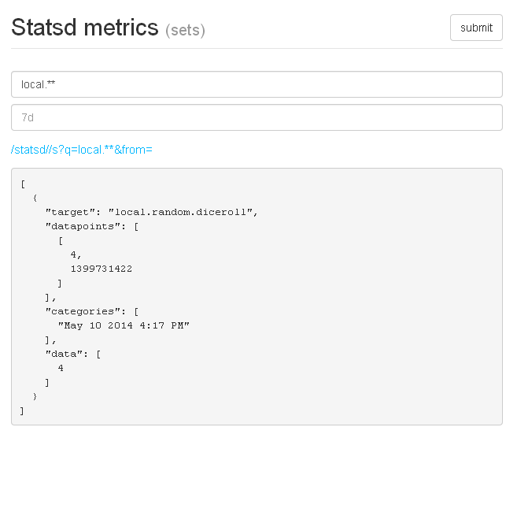

# statsd-fs

A statsd backend to emit stats to local file system.

Also provides an express application to browse and query serialized
metrics.

**Note** Only sets are correctly handled and written to FS (ex. `metric.name:99|s`)

## Install

    # not on npm: use the git url
    npm install statsd-fs

## Usage

Add the following settings to the StatsD configuration file:

```js
{
  backends: ['statsd-fs']
}
```

## Options

- `storage` - Absolute or relative to CWD path the the DB root directory
  (default: `./tmp/metrics`)

Ex.

```js
{
  backends: ['statsd-fs'],
  fs: {
    storage: '/tmp/statsd'
  }
}
```

## File structure

Metrics are serialized to file system in a way similar to Graphite. `.`
in metric keys are translated into `/` before beeing written.

    echo "local.random.diceroll:4|s" | nc -w0 localhost 8125

Should generate the following file: `./tmp/metrics/local/random/diceroll.json`

```json
{"name":"diceroll","timestamps":[1399731422],"metrics":[4],"raw":[[1399731422,4]]}
```

## Express App

The [app/](./app) directory holds a basic express application.

It provides a very simple interface to browse generated files and a
limited API to query the results.

### Usage

```js
var statsd = require('statsd-fs/app');

app.use('/statsd', statsd.middleware({
  base: './tmp/metrics'
}));
```

#### /



### /sets

Express directory / static middlewares mounted on `options.storage/sets`
directory.

### POST /

API entry point, queries the DB for requested target pattern.

**params**

- `q`: Query pattern (ex: `**`)
- `from`: A [momentjs](http://momentjs.com/docs/#/manipulating/subtract/) duration to filter the results on. Only timestamps after the from moment object should be returned (Default `7d`)

### GET /s

Alternate API endpoint. Uses querystring instead of `req.body`.

Ex:

- `/s?query=local.**&from=180min`
- `/s?query=**&from=60s`


## API

### FSBackend

```js
var FSBackend = require('statsd-fs').FSBackend;

// Statsd will create the backend using something like
var backend = new FSBackend(startupTime, config, events);

// It is an EventEmitter, and events from statsd are propagated to the
// backend instance

backend.on('flush', console.log.bind(console, 'Flushed: '));
backend.on('status', console.log.bind(console', 'Status: '));
```

## App

The express application.

```js
var statsd = require('statsd-fs').app;

// Attach to your top level express app
app.use('/statsd', statsd.middleware({
  base: './tmp/metrics'
}));

// Or use it directly

statsd.set('port', process.env.PORT || 3000);
var server = statsd.listen(statsd.get('port'), function() {
  debug('Express server listening on port ' + server.address().port);
});
```

## Sets

Provide read / write abstraction on top of the sets written to file DB.

Is using [node-glob](https://github.com/isaacs/node-glob) to perform the
file macthes.

```js
var Sets = require('statsd-fs').Sets;

var sets = new Sets('./path/to/db', {
  from: '7d'
});

sets.load('**', function(err, data) {
  if (err) return next(err);

  // Data:
  //
  // Array of formatted metrics object, with timestamps, metrics and raw values.
});
```

Sets emits the following events:

- `match` - From `glob.Glob`, emitted when a match is found.
- `error` - From `glob.Glob`, emitted when error occurs during the file
  pattern lookup.
- `abort` - From `glob.Glob`, emitted when the search is aborted.
- `end` - Emitted when the search is complete. Invoked with formatted
  data.


## TODOs

- [] Tests
- [] Git integration. Clone URLs for top level directories
- [] Decouple backend from express app
